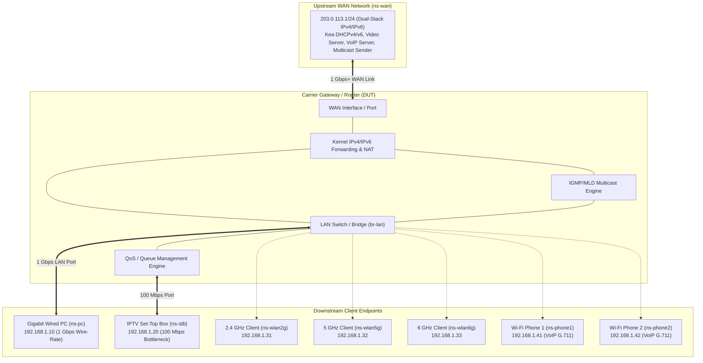

# Gateway Test & Automation Lab (`gwlab`)

A production Linux network test automation and performance benchmarking framework for carrier-grade residential gateways, broadband routers, and Wi-Fi access points (APs).

`gwlab` provides an extensible, modular architecture for validating wire-rate forwarding, switch buffer absorption, Quality of Service (QoS/WMM), concurrent multi-station throughput, and real-world application QoE (Cloud Gaming, 4K VOD, VoIP).

---

## 1. Key Capabilities

* **Dual Operational Modes**:
  * **Physical DUT Mode (`--single`)**: Connects to real hardware gateways via dedicated physical NICs and 802.1Q VLANs.
  * **Virtual Simulation Mode (`--virtual`)**: 100% software emulation via Linux network namespaces (`netns`), `veth` pairs, Linux bridges, and `tc` queue disciplines (zero external hardware required).
* **Extensible Scenario Framework**: Test cases are decoupled into plug-and-play modules under `scripts/scenarios/`, allowing scenarios to be added, customized, and extended across the project lifecycle.
* **Multi-Engine Traffic Generation**: Supports precision L2/L3 raw socket generators, RFC 2544 burst generators, real-world application emulators (GeForce NOW, UHD 1.2x VOD, G.711a VoIP SIP/RTP), and multi-stream `iperf3`.
* **Automated Evidence & Compliance Audit**: Dual-point synchronous packet capture (WAN & LAN), automated PCAP timeline correlation, strict quantitative metrics evaluation, and compressed artifact bundling.
* **Defensive Host Safety**: Automatic NetworkManager unmanaging on test interfaces, non-root diagnostic commands, idempotent cleanup, dry-run execution, and automatic rollback on error.

---

## 2. Test Architecture & Topology

The framework isolates all endpoints into dedicated Linux network namespaces connected to the Device Under Test (DUT):



> For complete wiring specifications, VLAN mappings, and interface schemas, see [docs/architecture/topology.md](docs/architecture/topology.md).

---

## 3. Quickstart Guide

### Step 0: Install Dependencies (First time only)

```bash
# Check for missing dependencies without root:
./scripts/install_deps.sh --check-only

# Install required packages (Kea, radvd, dnsmasq, iperf3, tcpdump, tshark, sipp, etc.):
sudo ./scripts/install_deps.sh
```

### Step 1: Configure Environment (`config.env`)

Copy the configuration template:
```bash
cp config.env.example config.env
```

Edit `config.env` to match your test bench. Key parameters:

| Parameter | Default / Example | Purpose |
| :--- | :--- | :--- |
| `TOPOLOGY_MODE` | `"virtual"` or `"physical"` | Execution mode (`virtual` for pure software netns; `physical` for real hardware DUT) |
| `WAN_IF` | `"enxd46e0e0c65e1"` | Physical Ethernet interface connected to DUT WAN port |
| `LAN_IF` / `PC_IF` | `"enx00e04c88293c"` | Physical Ethernet interface connected to DUT 1G LAN PC port |
| `STB_IF` | `""` (or dedicated NIC) | Physical interface connected to DUT 100M LAN port (empty = shared single LAN) |
| `DUT_SSID_2G` / `5G` | `"DUT_2.4G"` / `"DUT_5G"` | Target Wi-Fi SSIDs for wireless tests |
| `DUT_PASS_2G` / `5G` | `""` | Wi-Fi pre-shared keys |
| `REMOTE_CLIENT_ENABLED` | `"0"` (or `"1"`) | Enables secondary remote station for distributed over-the-air Wi-Fi load |

> [!WARNING]
> `config.env` contains local environment secrets and is ignored by Git. Do **not** run `git clean -fdx` as it will remove unversioned configuration files. Use `sudo ./scripts/cleanup.sh` to safely reset state.

### Step 2: Pre-Flight Environment Diagnostic

Verify system toolchains, kernel modules, and permissions before starting:
```bash
./scripts/diagnose.sh
```

### Step 3: Initialize Network Topology

```bash
# Physical Hardware DUT mode:
sudo ./scripts/setup.sh --single

# Or pure Virtual Simulation mode:
sudo ./scripts/setup.sh --virtual

# Inspect active runtime namespaces and link state:
./scripts/show_state.sh
```

### Step 4: Execute Test Scenarios

The test runner [`scenario.sh`](scripts/scenario.sh) automatically discovers and executes modular test scenarios:

```bash
# Run all test suites in compliance order:
sudo ./scripts/scenario.sh all

# Run specific scenario suites:
sudo ./scripts/scenario.sh wire_rate
sudo ./scripts/scenario.sh rate_mismatch
sudo ./scripts/scenario.sh real_world_stb
sudo ./scripts/scenario.sh simultaneous
sudo ./scripts/scenario.sh voice_qos
sudo ./scripts/scenario.sh wireless_qos

# Run with dry-run mode (validate arguments and logic without sending traffic):
./scripts/scenario.sh --dry-run all

# View global options and list of all available scenarios:
./scripts/scenario.sh -h

# View options for a specific scenario:
./scripts/scenario.sh -h voice_qos
./scripts/scenario.sh -h rate_mismatch
```

#### Common Runner Options:
* `-v, --debug, --verbose`: Display detailed execution commands (`[DEBUG] CMD: <command>`) at every step.
* `-s, --snaplen <bytes>`: Packet capture limit (default: `96` bytes for headers; `0` for full payload).
* `-C, --no-capture`: Skip packet capture to minimize disk I/O and overhead.
* `-A, --collect-artifacts`: Automatically bundle logs, metrics, and captures upon scenario completion.
* `-W, --wifi-mode <mode>`: Select wireless test mode (`auto`, `remote_only`, `distributed`, `virtual`).
* `-l, --log [file]`: Mirror test console output to a log file.

### Step 5: Verify Evidence & Compliance (Non-Root)

Evaluate captured metrics against quantitative pass/fail thresholds and inspect packet timelines:
```bash
./scripts/verify_compliance.sh
```

### Step 6: Collect Test Artifacts (Non-Root)

Package test deliverables (JSON benchmark metrics, raw iperf3 intervals, PCAPs, execution logs):
```bash
# Package latest test deliverables:
./scripts/collect_artifacts.sh --latest

# Extracted deliverables are available at:
ls -la artifacts/latest/
```

### Step 7: Teardown & Reset Lab

Safely clean up network namespaces, stop background services, and restore physical interfaces:
```bash
sudo ./scripts/cleanup.sh
```

---

## 4. Scenario Framework & Extensibility

`gwlab` is built as an extensible test framework. Test scenarios are modular bash scripts located in `scripts/scenarios/`. The core runner dynamically sources and registers all scenario modules at startup.

### Built-in Scenarios

| Scenario Identifier | Module | Focus Area |
| :--- | :--- | :--- |
| `wire_rate` (`unicast`, `multicast`) | `01_wire_rate.sh` | 1024-byte full-duplex wire-rate forwarding and IGMP multicast delivery |
| `rate_mismatch` (`burst_case1`, `burst_case2`) | `02_rate_mismatch.sh` | RFC 2544 switch buffer absorption (1 Gbps WAN to 100 Mbps LAN burst) |
| `real_world_stb` (`geforce`, `vod`) | `03_real_world_apps.sh` | GeForce NOW UDP gaming jitter and UHD+Dolby 1.2x VOD streaming QoE |
| `simultaneous` | `04_simultaneous.sh` | Concurrent wired + tri-band wireless throughput preservation |
| `voice_qos` | `05_voice_qos.sh` | G.711a VoIP SIP/RTP high-priority DSCP 46 isolation against background load |
| `wireless_qos` | `06_wireless_qos.sh` | WMM 802.11e EDCA Access Category prioritization under Wi-Fi saturation |

### Adding a New Test Scenario

To add a new scenario during the project lifecycle:
1. Create a scenario module: `scripts/scenarios/<number>_<scenario_name>.sh` implementing:
   - `usage_block_<scenario>()` (Help menu and flags)
   - `run_scenario_<scenario>()` (Test execution lifecycle)
2. Add precision test engines or Python analyzers under `tools/` if specialized traffic profiles are needed.
3. Document the scenario design in [`docs/scenarios/<scenario-name>.md`](docs/scenarios/).
4. Add pass/fail criteria to [`docs/test-plans/gateway-performance.md`](docs/test-plans/gateway-performance.md).

---

## 5. Directory Layout

```text
gwlab/
├── config.env                    # Active configuration parameters (local, git-ignored)
├── config.env.example            # Reference configuration template
├── README.md                     # Framework overview & quickstart guide
├── docs/                         # Structured documentation hub
│   ├── README.md                 # Documentation index & naming rules
│   ├── architecture/             # Topologies and system models
│   │   └── topology.md           # Physical testbed wiring & virtual netns layout
│   ├── test-plans/               # Verification plans and acceptance matrices
│   │   └── gateway-performance.md# Gateway performance baseline test plan
│   ├── scenarios/                # Scenario design specifications
│   │   ├── rate-mismatch-burst.md# 1G to 100M switch buffer burst absorption design
│   │   └── real-world-streaming.md# Cloud gaming & 4K VOD streaming QoE design
│   ├── guides/                   # Operational runbooks & developer guides
│   │   ├── troubleshooting.md    # Diagnostic and issue resolution runbook
│   │   └── shell-style.md        # Scripting and defensive coding standards
│   └── references/               # Technical references and evaluations
│       └── iperf-capabilities.md # Analysis of iperf2/iperf3 pacing & limitations
├── scripts/                      # Core automation scripts
│   ├── setup.sh                  # Topology initializer with rollback traps
│   ├── cleanup.sh                # Idempotent teardown and interface restorer
│   ├── scenario.sh               # Modular scenario test runner
│   ├── scenarios/                # Pluggable test scenario modules
│   ├── capture.sh                # Automated synchronous packet capture
│   ├── verify_compliance.sh      # Dual-layer verification & PCAP audit
│   ├── collect_artifacts.sh      # Test deliverable packager
│   ├── diagnose.sh               # Non-root pre-flight environment check
│   ├── show_state.sh             # Runtime status & queue observer
│   ├── wan_server.sh             # Upstream WAN DHCPv4/v6 emulator (Kea/dnsmasq)
│   ├── client_dhcp.sh            # LAN client DHCP manager (udhcpc/dhclient)
│   └── lib/                      # Shared bash helper libraries
├── tools/                        # Precision measurement and traffic engines
├── config/                       # Daemon templates (Kea DHCPv4/v6, radvd)
├── captures/                     # Packet capture evidence (*.pcap)
├── logs/                         # Execution logs and evaluated JSON metrics
├── state/                        # Active PID files and runtime topology state
└── artifacts/                    # Packaged test deliverables
```

---

## 6. Documentation Hub

For detailed specifications, operational manuals, and test designs, refer to the [Documentation Hub](docs/README.md):

* **Architecture & Topology**: [`docs/architecture/topology.md`](docs/architecture/topology.md)
* **Master Test Plan**: [`docs/test-plans/gateway-performance.md`](docs/test-plans/gateway-performance.md)
* **Switch Buffer & Burst Design**: [`docs/scenarios/rate-mismatch-burst.md`](docs/scenarios/rate-mismatch-burst.md)
* **Real-World Streaming QoE Design**: [`docs/scenarios/real-world-streaming.md`](docs/scenarios/real-world-streaming.md)
* **Troubleshooting & Diagnostics**: [`docs/guides/troubleshooting.md`](docs/guides/troubleshooting.md)
* **Shell Scripting Standards**: [`docs/guides/shell-style.md`](docs/guides/shell-style.md)
* **iperf Engine Analysis**: [`docs/references/iperf-capabilities.md`](docs/references/iperf-capabilities.md)
