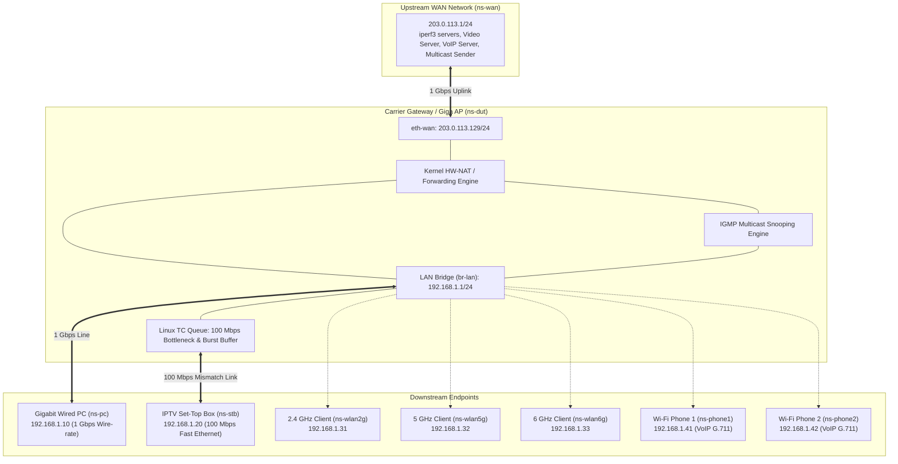

# Gateway Performance & Wire-Rate Test Lab (`gateway_perf_lab`)

A production Linux Network Test Lab framework designed to verify carrier-grade Gateway router and Access Point (AP) performance, including **Wire-rate Forwarding (Unicast & Multicast)**, **WAN-to-LAN Rate Mismatch Burst Absorption (1 Gbps WAN -> 100 Mbps STB)**, **Cloud Gaming (GeForce NOW) & UHD 1.2x VOD Experience**, **Simultaneous Wired/Wireless Tri-band Throughput**, and **Voice QoS Isolation**.

---

## 1. Test Architecture & Topology

The lab isolates endpoints into dedicated Linux Network Namespaces (`netns`) connected to a central Device Under Test (`ns-dut` in software simulation or external hardware):



---

## 2. Verified Test Cases & Acceptance Matrix

| Test ID | Test Category | Traffic Profile | Acceptance Criteria |
| :--- | :--- | :--- | :--- |
| **TC-WR-01** | Wire-Rate Unicast | Bidirectional full 1024-byte packets | **0% Packet Loss** (Wire-rate throughput) |
| **TC-WR-02** | Wire-Rate Multicast | Full forwarding 1024-byte multicast | **0% Packet Loss** |
| **TC-RM-01** | Rate Mismatch Burst | 1500B frames, 50% load, $\ge$ 53 frames | **0% Packet Loss** |
| **TC-RM-02** | Rate Mismatch Burst | 1500B frames, 16% load, 100 frames | **0% Packet Loss** |
| **TC-APP-01** | Cloud Gaming QoE | GeForce NOW UDP streaming | **Status "Normal"** (Loss 0%, Jitter < 2.0 ms) |
| **TC-APP-02** | High-rate Video QoE | UHD+Dolby VOD @ 1.2x playback | **Status "Normal"** ($\ge$ 35 Mbps, 0 stalls) |
| **TC-SIM-01** | Simultaneous Wired/Wireless | 2.4G + 5G + 6G + Wired (5 trials) | **$\|C - B\| / B \le 1.0\%$** (Preserve 1 Gbps) |
| **TC-QOS-01** | Voice QoS Isolation | PC throughput with 2 active Wi-Fi phone calls | **$\|A - B\| / A \le 1.0\%$** |

---

## 3. Directory Layout

```text
gateway_perf_lab/
├── config.env                    # Active configuration parameters
├── config.env.example            # Reference configuration template
├── README.md                     # Architecture, topology & quickstart guide
├── docs/
│   ├── TOPOLOGY.md               # Network architecture & physical/virtual topology
│   ├── TEST_PLAN.md              # Detailed verification test plan & metrics
│   ├── TROUBLESHOOTING.md        # Diagnostic and resolution guide
│   └── SHELL_STYLE.md            # Scripting standards
├── captures/                     # Storage for *.pcap evidence
├── logs/                         # Detailed JSON results & benchmark logs
├── state/                        # Active PID files and topology state
├── tools/                        # Precision measurement engines
│   ├── traffic_generator.py      # Wire-rate & Burst test tool
│   ├── geforce_now_tester.py     # Cloud Gaming network test emulator
│   ├── vod_stream_tester.py      # UHD+Dolby 1.2x VOD streaming tester
│   └── voip_call_simulator.py    # Dual Wi-Fi phone G.711 RTP call generator
└── scripts/
    ├── lib/common.sh             # Helper function library
    ├── install_deps.sh           # Host dependency & daemon installer
    ├── setup.sh                  # Multi-namespace topology initializer
    ├── cleanup.sh                # Idempotent cleanup & interface restorer
    ├── wan_server.sh             # Upstream WAN DHCP server emulator (Kea/dnsmasq)
    ├── client_dhcp.sh            # LAN client DHCP manager (udhcpc/dhclient)
    ├── capture.sh                # Automated background packet capture
    ├── show_state.sh             # Runtime status & queue observer
    ├── diagnose.sh               # Non-root pre-flight environment check
    ├── scenario.sh               # 5-phase automated scenario test runner
    └── verify_compliance.sh      # Dual-layer verification & PCAP inspector
```

---

## 4. Quickstart Guide

### Step 0: Install Host Dependencies (First time only)
```bash
# Check missing dependencies without root:
./scripts/install_deps.sh --check-only

# Install required packages (Kea, radvd, dnsmasq, iperf3, tcpdump, etc.):
sudo ./scripts/install_deps.sh
```

### Step 1: Pre-flight Check (Runs Non-Root)
```bash
./scripts/diagnose.sh
```

### Step 2: Deploy Network Topology
```bash
# Software simulation mode (Default, zero hardware required):
sudo ./scripts/setup.sh --virtual

# Or physical bench mode (Single-PC Dual-NIC):
sudo ./scripts/setup.sh --single
```

### Step 3: Inspect Network State
```bash
./scripts/show_state.sh
```

### Step 4: Execute Test Scenarios
```bash
# Run complete test suite (Phases 1 through 5):
sudo ./scripts/scenario.sh all

# Or run specific test phase:
sudo ./scripts/scenario.sh wire_rate
sudo ./scripts/scenario.sh rate_mismatch
sudo ./scripts/scenario.sh real_world_stb
sudo ./scripts/scenario.sh simultaneous
sudo ./scripts/scenario.sh voice_qos
```

### Step 5: Verify Evidence & Conformance (Runs Non-Root)
```bash
# Evaluates metric thresholds and prints PCAP packet timeline:
./scripts/verify_compliance.sh
```

### Step 6: Teardown Lab
```bash
sudo ./scripts/cleanup.sh
```
