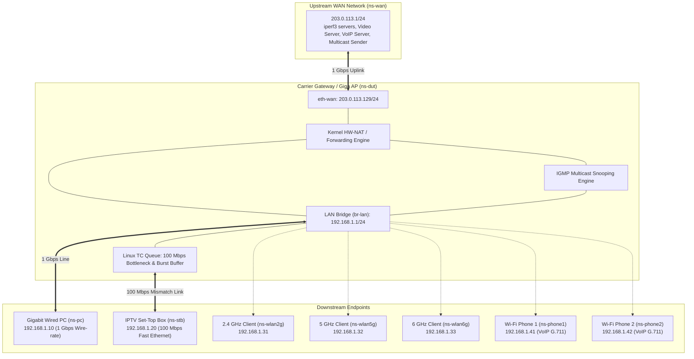

# Gateway Performance & Wire-Rate Test Lab (`gateway_perf_lab`)

A production Linux Network Test Lab framework designed to verify carrier-grade Gateway router and Access Point (AP) performance, including **Wire-rate Forwarding (Unicast & Multicast)**, **WAN-to-LAN Rate Mismatch Burst Absorption (1 Gbps WAN -> 100 Mbps STB)**, **Cloud Gaming (GeForce NOW) & UHD 1.2x VOD Experience**, **Simultaneous Wired/Wireless Tri-band Throughput**, and **Voice QoS Isolation**.

---

## 1. Test Architecture & Topology

The lab isolates endpoints into dedicated Linux Network Namespaces (`netns`) connected to a central Device Under Test (`ns-dut` in software simulation or external hardware):



---

## 2. Verified Test Cases & Acceptance Matrix

| Test ID | Test Category | Traffic Profile | Acceptance Criteria |
| :--- | :--- | :--- | :--- |
| **TC-WR-01** | Wire-Rate Unicast | Bidirectional full 1024-byte packets | **0% Packet Loss** (Wire-rate throughput) |
| **TC-WR-02** | Wire-Rate Multicast | Full forwarding 1024-byte multicast | **0% Packet Loss** |
| **TC-RM-01** | Rate Mismatch Burst | 1500B frames, 50% load, $\ge$ 53 frames | **0% Packet Loss** |
| **TC-RM-02** | Rate Mismatch Burst | 1500B frames, 16% load, 100 frames | **0% Packet Loss** |
| **TC-APP-01** | Cloud Gaming QoE | GeForce NOW UDP streaming | **Status "Normal"** (Loss 0%, Jitter < 2.0 ms) |
| **TC-APP-02** | High-rate Video QoE | UHD+Dolby VOD @ 1.2x playback | **Status "Normal"** ($\ge$ 35 Mbps, 0 stalls) |
| **TC-SIM-01** | Simultaneous Wired/Wireless | 2.4G + 5G + 6G + Wired (5 trials) | **$\text{Wired Degradation} \le 1.0\%$** (Preserve Wire-Rate 1 Gbps) |
| **TC-QOS-01** | Voice QoS Isolation | PC throughput with 2 active Wi-Fi phone calls | **$\|A - B\| / A \le 1.0\%$** |

---

## 3. Directory Layout

```text
gateway_perf_lab/
├── config.env                    # Active configuration parameters
├── config.env.example            # Reference configuration template
├── README.md                     # Architecture, topology & quickstart guide
├── docs/
│   ├── TOPOLOGY.md               # Network architecture & physical/virtual topology
│   ├── TEST_PLAN.md              # Detailed verification test plan & metrics
│   ├── TROUBLESHOOTING.md        # Diagnostic and resolution guide
│   └── SHELL_STYLE.md            # Scripting standards
├── captures/                     # Storage for *.pcap evidence
├── logs/                         # Detailed JSON results & benchmark logs
├── state/                        # Active PID files and topology state
├── tools/                        # Precision measurement engines
│   ├── traffic_generator.py      # Wire-rate & Burst test tool
│   ├── geforce_now_tester.py     # Cloud Gaming network test emulator
│   ├── vod_stream_tester.py      # UHD+Dolby 1.2x VOD streaming tester
│   └── voip_call_simulator.py    # Dual Wi-Fi phone G.711 RTP call generator
└── scripts/
    ├── lib/common.sh             # Helper function library
    ├── install_deps.sh           # Host dependency & daemon installer
    ├── setup.sh                  # Multi-namespace topology initializer
    ├── cleanup.sh                # Idempotent cleanup & interface restorer
    ├── wan_server.sh             # Upstream WAN DHCP server emulator (Kea/dnsmasq)
    ├── client_dhcp.sh            # LAN client DHCP manager (udhcpc/dhclient)
    ├── capture.sh                # Automated background packet capture
    ├── show_state.sh             # Runtime status & queue observer
    ├── diagnose.sh               # Non-root pre-flight environment check
    ├── scenario.sh               # 5-phase automated scenario test runner
    └── verify_compliance.sh      # Dual-layer verification & PCAP inspector
```

---

## 4. Environment Configuration (`config.env`)

The lab configuration is driven by `config.env`. Copy `config.env.example` to `config.env` to configure your environment:

```bash
cp config.env.example config.env
```

### Key Parameters in `config.env`

| Parameter | Recommended Value / Example | Description |
| :--- | :--- | :--- |
| `TOPOLOGY_MODE` | `"physical"` or `"virtual"` | Use `"physical"` for real DUT hardware bench; `"virtual"` for pure software simulation. |
| `WAN_IF` | `"enx6c1ff76608e2"` | Physical Ethernet interface connected to DUT WAN port. |
| `LAN_IF` / `PC_IF` | `"enx6c1ff7660842"` | Physical Ethernet interface connected to DUT 1 Gbps LAN PC port. |
| `DUT_SSID_2G` | `"U+NetF254"` | Target 2.4 GHz wireless SSID on the DUT. |
| `DUT_SSID_5G` | `"U+NetF254_5G"` | Target 5 GHz wireless SSID on the DUT. |
| `DUT_PASS_2G` / `5G` | `"1234567890"` | WPA2/WPA3 pre-shared key for DUT Wi-Fi. |
| `REMOTE_CLIENT_ENABLED` | `"1"` | Enables secondary remote PC for distributed over-the-air Wi-Fi load. |
| `REMOTE_CLIENT_HOST` | `"192.168.100.84"` | Management IP address of the remote test station. |
| `REMOTE_CLIENT_USER` | `"network"` | SSH username on the remote station (**Do not leave as `${USER}`** when running under `sudo`). |
| `REMOTE_CLIENT_KEY` | `"~/.ssh/id_ed25519"` | Path to SSH private or public key (expanded automatically under `sudo`). |
| `REMOTE_CLIENT_DIR` | `"/home/network/workspace/gateway_perf_lab"` | Repository path on the remote PC. |

> [!WARNING]
> **Warning regarding `git clean`**: `config.env` is deliberately listed in `.gitignore` to prevent committing sensitive passwords and lab-specific IP configurations.
> Running `git clean -x` (e.g. `git clean -fdx`) **will permanently delete `config.env`**!
> * To safely reset runtime state and netns without losing your configuration, use: `sudo ./scripts/cleanup.sh`.
> * If you need to clean git untracked files, run: `git clean -fd` (**without** `-x`).
> * If `config.env` is ever deleted, restore it from `config.env.example` and re-apply your DUT SSIDs and remote client settings.

---

## 5. Quickstart Guide

### Step 0: Install Host Dependencies (First time only)
```bash
# Check missing dependencies without root:
./scripts/install_deps.sh --check-only

# Install required packages (Kea, radvd, dnsmasq, iperf3, tcpdump, sipp, etc.):
sudo ./scripts/install_deps.sh
```

### Step 1: Pre-flight Check & Remote Probing
```bash
# Verify local environment readiness:
./scripts/diagnose.sh

# Verify remote station connectivity and Wi-Fi link (if using distributed mode):
./scripts/remote_client.sh test
./scripts/remote_client.sh wifi-status

# Synchronize codebase to remote station:
./scripts/remote_client.sh sync
```

### Step 2: Deploy Network Topology
```bash
# Physical testbed mode (connects to real DUT via physical NICs):
sudo ./scripts/setup.sh --single

# Or pure software simulation mode (zero hardware required):
sudo ./scripts/setup.sh --virtual
```

### Step 3: Inspect Network State
```bash
./scripts/show_state.sh
```

### Step 4: Execute Test Scenarios
```bash
# Run complete test suite (Phases 1 through 5):
sudo ./scripts/scenario.sh all

# Or run specific test phases:
sudo ./scripts/scenario.sh wire_rate
sudo ./scripts/scenario.sh rate_mismatch
sudo ./scripts/scenario.sh real_world_stb
sudo ./scripts/scenario.sh simultaneous

# Tra cứu trợ giúp và các options hỗ trợ (hiển thị theo từng khối độc lập):
./scripts/scenario.sh -h

# Tra cứu nhanh options cho riêng một test case cụ thể:
./scripts/scenario.sh -h voice_qos
./scripts/scenario.sh -h tc_sim_01
./scripts/scenario.sh -h unicast

# Run Voice QoS with 2 concurrent phone calls on Remote Wi-Fi Station:
sudo ./scripts/scenario.sh voice_qos -W remote_only -E sipp -d 30
```

#### Global Scenario Options:
* `-v, --debug, --verbose`: Hiển thị log chi tiết các lệnh thực thi (`[DEBUG]   CMD: <command>`) ở từng bước (network routing, iptables DSCP mangle, packet captures, traffic generators, iperf3, VoIP SIP/RTP engines, remote SSH commands, parser evaluations).
* `-s, --snaplen <bytes>`: Packet payload capture limit (default: `96` bytes; `0` = full packet). Capturing 96 bytes retains complete protocol headers (Ethernet + VLAN + IPv4/IPv6 + TCP/UDP/RTP + DSCP/TOS) for audit evidence while reducing PCAP storage by >95% and eliminating disk I/O bottlenecks. Can also be set globally via `CAPTURE_SNAPLEN` in `config.env`.
* `-A, --collect-artifacts`: Automatically packages all deliverables (metrics, raw iperf, logs, PCAPs, system state) into a compressed bundle in `artifacts/` upon completion.
* `-W, --wifi-mode <mode>`: Set adaptive Wi-Fi mode (`auto`, `remote_only`, `distributed`, `physical_single`, `virtual`).
* `-n, --dry-run`: Validate syntax, command generation, and parameters without modifying network state or sending traffic.

#### Rate Mismatch Burst Options (`scenario.sh burst_case1`, `burst_case2`, `rate_mismatch`):
* Tự động điều chỉnh tốc độ cổng vật lý (Automated 100M Link Adaptation): Khi chạy ở chế độ phần cứng (`TOPOLOGY_MODE="physical"` với topology 1 cổng LAN chia sẻ), script tự động hạ tốc độ đàm phán của card mạng LAN vật lý từ 1 Gbps xuống **100 Mbps Full-Duplex** (`ethtool -s <if> speed 100 duplex full autoneg on`) trước khi bắn burst.
  * Điều này tạo ra nút thắt cổ chai vật lý thực sự (1 Gbps Ingress từ WAN -> 100 Mbps Egress ra cổng LAN của DUT), buộc switch chip của DUT phải buffer burst (53 frames ở 50% load hoặc 100 frames ở 16% load) theo đúng tiêu chuẩn RFC 2544 / ITU-T.
  * Sau khi hoàn tất (hoặc khi xảy ra lỗi/ngắt `Ctrl+C` thông qua defensive trap), hệ thống tự động khôi phục cổng LAN về **1000 Mbps (Gigabit Auto-Negotiation)** và làm ấm lại bảng ARP.
* `--no-adapt-speed`: Tắt tính năng tự động đàm phán 100M (giữ nguyên tốc độ link hiện tại của cổng mạng LAN).

#### Wire-Rate Unicast Execution Options (`scenario.sh unicast`):
* `-b, --bitrate <rate>`: Tốc độ kiểm thử mục tiêu (mặc định: `950M`, ví dụ: `950M`, `475M`, `1G`). PPS được tính toán động dựa trên frame size 1024B (`~116k PPS` ở 950M, `~58k PPS` ở 475M).
* `-U, --unicast-mode <mode>`:
  * `sequential` (Mặc định): Đo tuần tự từng chiều độc lập ở tốc độ Wire-Rate (Forward rồi Reverse) với 0% loss, cách ly hoàn toàn lỗi của từng path.
  * `concurrent`: Đo đồng thời cả 2 chiều ở tốc độ chỉ định mỗi chiều (Tổng lưu lượng Full-Duplex qua DUT nhân đôi).
* `-O, --omit <seconds>`: Thời gian làm ấm (warm-up) bỏ qua không tính điểm (mặc định: `2` giây), giúp DUT có thời gian nạp bảng Hardware Flow Offloading / FastPath trước khi thu thập số liệu steady-state.
* `-d, --duration <seconds>`: Thời lượng phát lưu lượng mỗi chiều (mặc định: `10` giây).

#### VoIP QoS Execution Options (`scenario.sh voice_qos`):
* `-W, --wifi-mode <mode>`:
  * `remote_only`: Both phone calls run over the air on the remote Wi-Fi PC (bypasses unstable local Wi-Fi).
  * `distributed`: Phone 1 runs on local physical Wi-Fi, Phone 2 runs on remote Wi-Fi PC.
  * `physical_single`: Both calls run on the local physical Wi-Fi adapter.
  * `virtual`: Calls run inside software network namespaces (`ns-phone1`, `ns-phone2`).
* `-E, --voip-engine <engine>`:
  * `sipp`: Carrier-grade SIP + G.711a RTP media generation marked with **DSCP 46 (EF)**.
  * `pjsua`: Production SIP softphone engine with auto-answer loopback.
  * `python`: Lightweight Python socket RTP emulator.

#### Simultaneous Throughput & Audit (`scenario.sh simultaneous`):
* Automatically captures multi-point PCAP evidence synchronously across WAN, Wired LAN, and Wi-Fi interface.
* Performs stream-disaggregated cross-DUT frame auditing (Port 5201 for Wired PC, Ports 5202-5204 for Wi-Fi stations) to ensure zero packet drop without false mismatches.

### Step 5: Verify Evidence & Compliance (Runs Non-Root)
```bash
# Evaluates metric thresholds and prints PCAP packet timeline:
./scripts/verify_compliance.sh
```

### Step 6: Collect Test Artifacts & Audit Evidence (Runs Non-Root)
```bash
# Package all test deliverables (metrics, raw iperf3 trials, PCAPs, logs, system state):
./scripts/collect_artifacts.sh

# Or package only the latest test run:
./scripts/collect_artifacts.sh --latest

# Or package lightweight bundle without large PCAPs:
./scripts/collect_artifacts.sh --no-pcap

# Extracted deliverables are always accessible via:
ls -la artifacts/latest/
```

#### Test Deliverable Storage Locations:
* **Evaluated Benchmark Metrics**: `logs/*.json` (`simultaneous_benchmark.json`, `unicast_result.json`, `qos_benchmark.json`, etc.)
* **Raw iperf3 Trial Outputs**: `logs/raw_iperf/*.json` (per-trial second-by-second intervals, CWND, and retransmit stats)
* **Packet Captures**: `captures/*.pcap` (isolated per test scenario)
* **Execution Logs**: `logs/scenario_<tag>_<timestamp>.log`
* **Packaged Deliverables**: `artifacts/gw_perf_artifact_<timestamp>.tar.gz` and `artifacts/latest/`

### Step 7: Safe Teardown Lab
```bash
# Tears down network namespaces, stops background capture, and restores physical interfaces:
sudo ./scripts/cleanup.sh
```
