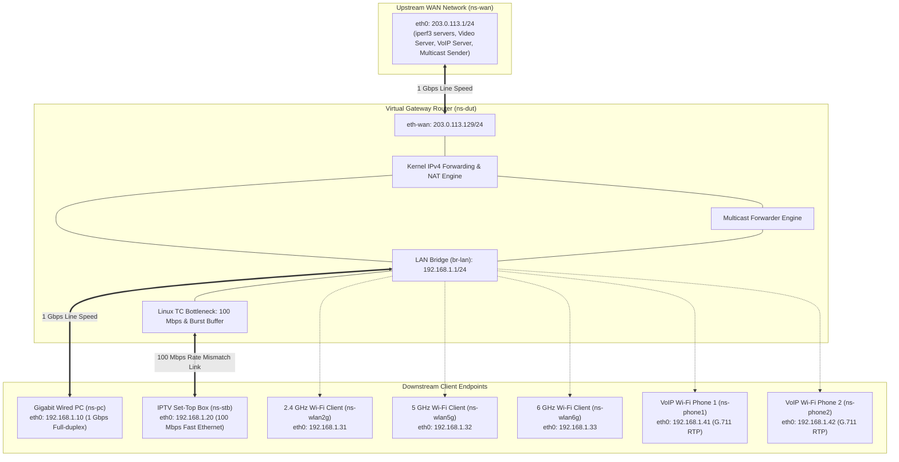

# Network Lab Architecture & Topology Specification

This document details the architectural layout, interface mappings, addressing schema, and interconnection topologies for the **Gateway Performance & Wire-Rate Test Lab (`gateway_perf_lab`)**.

The test lab supports two primary operational modes:
1. **Virtual Simulation Mode (`--virtual`)**: End-to-end software emulation using Linux network namespaces (`netns`), virtual ethernet pairs (`veth`), and Traffic Control (`tc`) queue disciplines.
2. **Physical Hardware DUT Mode (`--single`)**: Multi-port hardware testbed interconnecting physical network interface cards (NICs) on the test workstation to an external physical Carrier Gateway / Access Point (AP) Device Under Test (DUT).

---

## 1. Network Topologies

### 1.1 Physical Hardware DUT Interconnect Topology

In hardware testing mode, the test workstation hosts isolated network namespaces that terminate individual physical cables (or 802.1Q tagged VLANs) connected to the physical ports of the DUT.

```
+-----------------------------------------------------------------------------------------+
|                                  PHYSICAL GATEWAY DUT                                   |
|                                                                                         |
|   [WAN Port]           [LAN 1G Port]          [LAN 100M Port]      [Tri-Band Wi-Fi]     |
|   (VLAN 1: eth1.1)     (Wired PC)             (IPTV STB)           (wl0, wl1, wl2)      |
+---------+--------------------+----------------------+--------------------+--------------+
          |                    |                      |                    |
          | Ethernet Cable     | Ethernet Cable       | Ethernet Cable     | Wireless RF
          | (Cat5e / Cat6)     | (Cat5e / Cat6)       | (Cat5e / Cat6)     | (2.4G/5G/6G)
          |                    |                      |                    |
+---------+--------------------+----------------------+--------------------+--------------+
|   [WAN_IF]             [PC_IF / LAN_IF]       [STB_IF]             [Wi-Fi Client NICs]  |
|   enxd46e0e0c65e1      enx00e04c88293c        (Dedicated NIC)      (Wi-Fi Adapters)     |
|                                                                                         |
|   Namespace:           Namespace:             Namespace:           Namespace:           |
|   ns-wan               ns-pc                  ns-stb               ns-wlan2g/5g/6g      |
|   IP: 203.0.113.1/24   IP: 192.168.1.10/24    IP: 192.168.1.20/24  IP: 192.168.1.31-33  |
|   (DHCP Server ON)                                                                      |
+-----------------------------------------------------------------------------------------+
|                                     TEST WORKSTATION                                    |
+-----------------------------------------------------------------------------------------+
```

### 1.2 Virtual Simulation Topology (Netns & Veth)



---

## 2. Interface & Subnet Reference Matrix

| Entity | Namespace | Interface | IP Address / Prefix | Speed / Profile | Description |
| :--- | :--- | :--- | :--- | :--- | :--- |
| **Upstream WAN Gateway** | `ns-wan` | `eth0` (or `eth-raw.1`) | `203.0.113.1/24` | 1 Gbps | Upstream server network, hosts DHCP server, iperf3, and multicast senders. |
| **DUT WAN Interface** | `ns-dut` / Hardware | `eth-wan` / `eth1.1` | `203.0.113.129/24` | 1 Gbps | External gateway interface facing the upstream network (802.1Q VLAN 1 tagged). |
| **DUT LAN Gateway** | `ns-dut` / Hardware | `br-lan` / `br0` | `192.168.1.1/24` | Switching Fabric | Internal LAN bridge interconnecting all physical and wireless LAN ports. |
| **Gigabit Wired PC** | `ns-pc` | `eth0` | `192.168.1.10/24` | 1 Gbps Full-duplex | High-throughput client for wire-rate unicast forwarding and QoS evaluation. |
| **IPTV Set-Top Box** | `ns-stb` | `eth0` | `192.168.1.20/24` | 100 Mbps Half/Full | Rate-mismatched client for burst absorption, GeForce NOW, and 4K VOD tests. |
| **Wi-Fi 2.4 GHz Client** | `ns-wlan2g` | `eth0` | `192.168.1.31/24` | 802.11ax/be 2.4G | Downstream wireless client for simultaneous multi-band throughput tests. |
| **Wi-Fi 5 GHz Client** | `ns-wlan5g` | `eth0` | `192.168.1.32/24` | 802.11ax/be 5G | High-throughput 5 GHz wireless client. |
| **Wi-Fi 6 GHz Client** | `ns-wlan6g` | `eth0` | `192.168.1.33/24` | 802.11ax/be 6G | Ultra-high throughput 6 GHz wireless client. |
| **Wi-Fi Phone 1** | `ns-phone1` | `eth0` | `192.168.1.41/24` | G.711 RTP (DSCP EF) | Active VoIP handset generating bidirectional voice calls. |
| **Wi-Fi Phone 2** | `ns-phone2` | `eth0` | `192.168.1.42/24` | G.711 RTP (DSCP EF) | Peer VoIP handset for voice QoS isolation benchmark. |
| **Multicast IPTV Group** | All endpoints | IGMPv2 / v3 | `239.255.0.1:5003` | 80 Mbps UDP Stream | Standard multicast distribution group for IPTV channel simulation. |

---

## 3. Upstream WAN Public Addressing (RFC 5737)

The upstream WAN subnet utilizes the official IETF standard public documentation/test range:
* **RFC 5737 TEST-NET-3**: `203.0.113.0/24`
* **Subnet Mask**: `255.255.255.0` (`/24`)
* **Upstream Server IP**: `203.0.113.1`
* **DUT Static WAN IP**: `203.0.113.129`
* **WAN DHCP Dynamic Pool**: `203.0.113.100` – `203.0.113.200`

Using an official public IP range guarantees:
1. **Accurate NAT Traversal**: Ensures the hardware NAT accelerator functions under standard public-to-private addressing rules.
2. **Zero RFC 1918 Collisions**: Eliminates routing conflicts with local enterprise subnets or LAN subnets (`192.168.1.0/24`).

---

## 4. Hardware DUT Integration & Configuration

When deploying against a physical gateway DUT, the DUT must receive an IP address within the `203.0.113.0/24` subnet on its WAN interface.

### Method A: Automated WAN DHCP Server (Recommended — Zero-Config)
The upstream WAN DHCP service is managed via [`scripts/wan_server.sh`](file:///home/dddat/workspace/gateway_perf_lab/scripts/wan_server.sh), which controls carrier-grade Kea DHCPv4 and lightweight `dnsmasq` DHCP fallback inside the `ns-wan` namespace:
- Leases IP addresses within `203.0.113.100` – `203.0.113.200`.
- Automatically advertises `203.0.113.1` as Default Gateway and `8.8.8.8` as public DNS.
- Requires zero manual intervention on the DUT if its WAN port runs in DHCP client mode.

```bash
# Manage WAN DHCP server explicitly:
sudo ./scripts/wan_server.sh start      # Starts Kea or dnsmasq auto-fallback
sudo ./scripts/wan_server.sh status     # Displays running daemons and active leases
sudo ./scripts/wan_server.sh stop       # Gracefully terminates all WAN server daemons
```

### Method B: Static IP Assignment via DUT Management CLI
If the DUT operates with static WAN configuration, execute the following commands on the DUT shell:

```sh
# 1. Assign public IP to the tagged WAN sub-interface (e.g., eth1.1 or vlan1)
ifconfig eth1.1 203.0.113.129 netmask 255.255.255.0 up

# 2. Point default routing to the test workstation WAN server
ip route replace default via 203.0.113.1 dev eth1.1

# 3. Verify routing table entries
ip route show
# Expected output:
# default via 203.0.113.1 dev eth1.1
# 203.0.113.0/24 dev eth1.1 proto kernel scope link src 203.0.113.129
# 192.168.1.0/24 dev br0 proto kernel scope link src 192.168.1.1
# 239.0.0.0/8 dev br0 scope link
```

### Method C: Dynamic DHCP Client on Downstream LAN Devices
To verify the DUT LAN DHCP server (`br0`), LAN endpoints (`ns-pc`, `ns-stb`, `ns-phone*`, `ns-wlan*`) can acquire dynamic leases using [`scripts/client_dhcp.sh`](file:///home/dddat/workspace/gateway_perf_lab/scripts/client_dhcp.sh):
- Uses namespace-safe event scripts (`scripts/lib/udhcpc.script`) without altering host `/etc/resolv.conf`.
- Sends custom Hostname (Option 12) and Vendor Class Identifier (Option 60) signaling.
- Falls back to static addressing if the DUT DHCP server is unreachable.

```bash
# Request / renew DHCP leases across all LAN namespaces:
sudo ./scripts/client_dhcp.sh renew all

# Or renew specific endpoints:
sudo ./scripts/client_dhcp.sh renew pc
sudo ./scripts/client_dhcp.sh renew stb

# Inspect current LAN IPs, gateways, and DHCP lease status:
./scripts/client_dhcp.sh status

# Release leases and tear down client daemons:
sudo ./scripts/client_dhcp.sh release
```

---

## 5. Physical Wiring & Adapter Configuration

Configure physical network adapters in [`config.env`](file:///home/dddat/workspace/gateway_perf_lab/config.env):

```bash
# 1. Enable Physical Topology Mode
TOPOLOGY_MODE="physical"

# 2. Assign Physical Host Interfaces
WAN_IF="enxd46e0e0c65e1"         # Cabled to Gateway WAN port
PC_IF="enx00e04c88293c"          # Cabled to Gateway 1 Gbps LAN port
STB_IF="<dedicated_stb_nic>"     # Cabled to Gateway 100 Mbps LAN port (or 802.1Q trunk)

# 3. 802.1Q WAN VLAN Tagging
# Set to "1" if DUT WAN port expects 802.1Q tagged traffic (e.g. eth1.1)
WAN_VLAN_ID="1"

# 4. WAN Parameters
WAN_SERVER_IP="203.0.113.1"
DUT_WAN_IP="203.0.113.129"
WAN_GATEWAY="203.0.113.1"
WAN_PREFIX="24"
WAN_DHCP_ENABLE="1"
WAN_DHCP_RANGE_START="203.0.113.100"
WAN_DHCP_RANGE_END="203.0.113.200"

# 5. LAN Parameters
DUT_LAN_IP="192.168.1.1"
PC_IP="192.168.1.10"
STB_IP="192.168.1.20"
```

---

## 6. Execution Workflow

### Step 1: Pre-flight Diagnostic Check
```bash
./scripts/diagnose.sh
```

### Step 2: Initialize Topology
```bash
# Deploy software simulation:
sudo ./scripts/setup.sh --virtual

# Or deploy hardware physical testbed:
sudo ./scripts/setup.sh --single
```

### Step 3: Run Full Benchmark Suite
```bash
sudo ./scripts/scenario.sh all
```

### Step 4: Verify Metrics & PCAP Timeline
```bash
./scripts/verify_compliance.sh
```

### Step 5: Teardown & Adapter Restoration
```bash
sudo ./scripts/cleanup.sh
```
