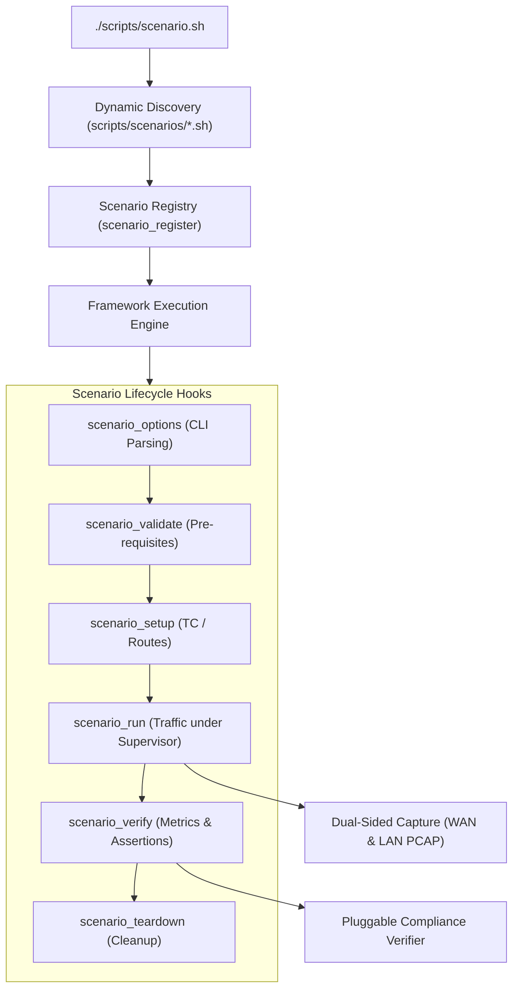

# Scenario Development Guide

This guide describes how to create, configure, and execute custom network test scenarios using the `nwlab` test framework.

---

## 1. Overview of Scenario Architecture

The `nwlab` framework uses a pluggable, hook-driven architecture. Any Bash script placed in `scripts/scenarios/*.sh` conforming to the scenario specification is automatically discovered, indexed, and made executable via `./scripts/scenario.sh`.



---

## 2. Anatomy of a Scenario Module

Every scenario script must implement the standard lifecycle functions and register itself using `scenario_register`:

```bash
#!/usr/bin/env bash
# scripts/scenarios/10_custom_throughput.sh

# 1. Defensive Bootstrap
if ! declare -F scenario_register >/dev/null 2>&1; then
    source "$(cd "$(dirname "${BASH_SOURCE[0]}")/../lib" && pwd)/scenario_framework.sh"
fi

# 2. Defaults
MY_RATE="500M"
MY_DURATION=10

# 3. Custom CLI Options
my_scenario_options() {
    while [[ $# -gt 0 ]]; do
        case "$1" in
            --bitrate|-b) MY_RATE="$2"; shift 2 ;;
            *) shift ;;
        esac
    done
}

# 4. Validation Hook
my_scenario_validate() {
    check_command iperf3 || { log_error "iperf3 required"; return 1; }
    return 0
}

# 5. Main Traffic Execution Hook
my_scenario_run() {
    local wan_ns="${WAN_NS:-ns-wan}"
    local lan_ns="${PC_NS:-ns-pc}"
    local server_ip="${WAN_SERVER_IP:-10.10.0.1}"
    local port=5201

    if (( ${DRY_RUN:-0} == 1 )); then
        log_info "[DRY-RUN] Would run throughput test at ${MY_RATE}"
        return 0
    fi

    # Start server in background under supervisor
    orchestrator_start_ns_bg "srv" "${wan_ns}" \
        "${LOG_DIR}/srv.log" "${LOG_DIR}/srv_err.log" \
        iperf3 -s -p "${port}" -1

    # Deterministic synchronization (no arbitrary sleeps)
    wait_for_port "${port}" "${server_ip}" 5 "${wan_ns}"

    # Start client stream under supervisor
    traffic_run_bg --job "cli" --netns "${lan_ns}" \
        --out "${LOG_DIR}/my_raw.json" \
        iperf3 -c "${server_ip}" -p "${port}" -u -b "${MY_RATE}" -t "${MY_DURATION}" -J

    # Wait for completion
    traffic_wait_all "cli"
    traffic_stop_group "srv"
}

# 6. Verification Hook
my_scenario_verify() {
    if (( ${DRY_RUN:-0} == 1 )); then return 0; fi
    # Assert criteria and log results
    return 0
}

# 7. Registration Hook
scenario_register \
    --id "custom_tp" \
    --name "Custom Throughput Benchmark" \
    --desc "Measures UDP throughput between WAN and LAN" \
    --aliases "tp,custom" \
    --lan-ns "${PC_NS:-ns-pc}" \
    --bpf "udp port 5201" \
    --duration 10 \
    --run-fn "my_scenario_run" \
    --validate-fn "my_scenario_validate" \
    --verify-fn "my_scenario_verify" \
    --options-fn "my_scenario_options"
```

---

## 3. The 18 Golden Rules for Scenarios

1. **Defensive Bash**: Always use strict mode in scripts (`set -Eeuo pipefail`, `IFS=$'\n\t'`).
2. **Namespace Isolation**: Run server components in `${WAN_NS:-ns-wan}` and client components in LAN namespaces (e.g. `${PC_NS:-ns-pc}`, `${STB_NS:-ns-stb}`).
3. **Traffic Supervision**: Never launch loose background jobs (`cmd &`). Always use `orchestrator_start_ns_bg` or `traffic_run_bg`.
4. **Deterministic Waiting**: Never use arbitrary `sleep 5`. Always use `wait_for_port <port> <host> <timeout> <ns>`.
5. **Dry-Run Support**: Check `if (( ${DRY_RUN:-0} == 1 )); then ... return 0; fi` in all execution and verification hooks.
6. **BPF Capture Filters**: Specify the minimum required BPF capture filter in `--bpf` to keep PCAPs compact and focused.
7. **Clean Outputs**: Store evaluated test metrics in `${LOG_DIR}/<scenario_id>_result.json`.

---

## 4. Running and Verifying Scenarios

```bash
# List all registered scenarios:
./scripts/scenario.sh list

# View options for a specific scenario:
./scripts/scenario.sh -h custom_tp

# Validate parameters in Dry-Run mode:
./scripts/scenario.sh --dry-run custom_tp

# Run a single scenario:
sudo ./scripts/scenario.sh custom_tp

# Run all scenarios in suite:
sudo ./scripts/scenario.sh all

# Verify compliance results:
./scripts/verify_compliance.sh custom_tp

# Package deliverables into artifacts bundle:
./scripts/collect_artifacts.sh
```
