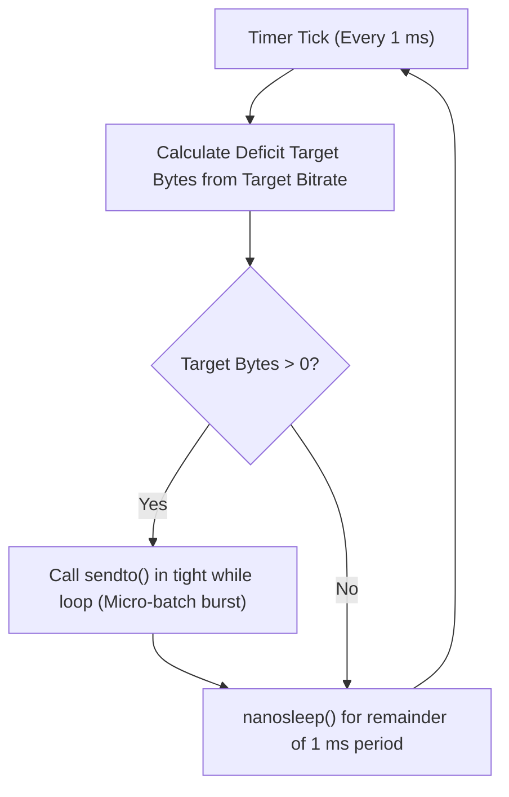
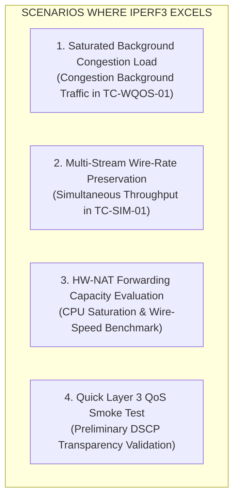
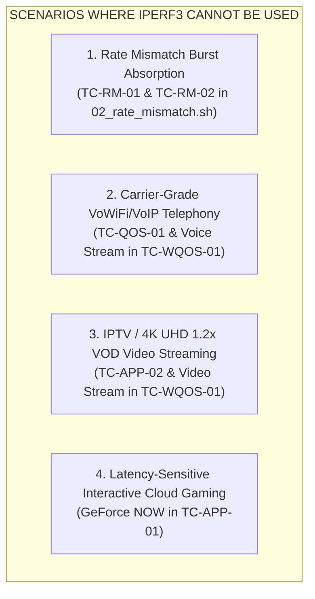

# TECHNICAL ANALYSIS REPORT: EVALUATION OF IPERF ENGINE CAPABILITIES, OPERATIONAL MECHANISMS, AND LIMITATIONS IN GATEWAY TESTING

> **Project Reference**: [gwlab](../../README.md)  
> **Related Documents**:  
> - [docs/test-plans/gateway-performance.md](../test-plans/gateway-performance.md) — Gateway Performance Verification Test Plan  
> - [docs/scenarios/rate-mismatch-burst.md](../scenarios/rate-mismatch-burst.md) — Switch Buffer Absorption under Rate Mismatch Design  
> - [docs/scenarios/real-world-streaming.md](../scenarios/real-world-streaming.md) — Cloud Gaming & 4K VOD QoE Test Design  
> - [scripts/scenarios/02_rate_mismatch.sh](../../scripts/scenarios/02_rate_mismatch.sh) — Rate Mismatch Burst Scenarios (TC-RM-01, TC-RM-02)  
> - [scripts/scenarios/06_wireless_qos.sh](../../scripts/scenarios/06_wireless_qos.sh) — Wireless QoS & WMM Scenario (TC-WQOS-01)  

---

## 1. TECHNICAL OVERVIEW & CONTEXT

### 1.1. Role of iperf in Network Benchmarking
`iperf` (comprising **iperf 2** and **iperf 3**) is the industry-standard open-source toolset most widely used for measuring network bandwidth (Throughput), latency (Round-Trip Time / RTT), and delay variation (Jitter) across Layer 4 transport protocols (TCP, UDP, SCTP).

However, in specialized carrier-grade test laboratories evaluating telecommunications equipment (Broadband Residential Gateways, Wi-Fi Access Points, L2/L3 Ethernet Switches), choosing the right traffic generator requires an in-depth understanding of **real-time traffic pacing mechanisms (Pacing Engines)**, **protocol header encapsulation structures**, and **hardware interactions (Switch Buffers & Hardware-NAT / FastPath)**.

### 1.2. Key Distinctions Between iperf 2 (`iperf`) and iperf 3 (`iperf3`)
Despite sharing a similar name, `iperf 2` and `iperf 3` are completely independent codebases with fundamentally different technical properties:

| Technical Characteristic | iperf 2 (`iperf`) | iperf 3 (`iperf3`) |
| :--- | :--- | :--- |
| **Bandwidth Unit (`-b`)** | Supports bit/s (`k/m/g`) **AND packets/sec (`pps`)** | **ONLY supports bit/s (`K/M/G`)**, with `/#` syntax for batching |
| **Control Channel** | Does not require a separate TCP channel for UDP | **Requires a dedicated TCP control channel (port 5201)** before sending UDP |
| **Connection Model** | Multi-client concurrent connections to 1 server port | **Single-client per process** |
| **Bidirectional Mode** | Seamless full-duplex support (`-d`) | Supported via `--bidir`, but prone to control channel contention |
| **Pacing Mechanism** | Inter-packet delay loop | Pacing timer loop (default: 1 ms) or Linux `sch_fq` |

> [!WARNING]
> The `-b 50pps` syntax exists ONLY in **iperf 2**. Passing `50pps` to **iperf 3** immediately triggers a syntax error:  
> `iperf3: parameter error - invalid unit value or suffix: '50pps'`.  
> To generate an equivalent 50 pps stream (172-byte packets) on `iperf3`, you must convert to bitrate: $50 \times 172 \times 8 = 68,800\text{ bps} \approx \mathbf{69K}$.

---

## 2. TRAFFIC PACING & PACKET SCHEDULING MECHANISMS

### 2.1. Timer-Based Pacing Mechanism in iperf3
Unlike dedicated hardware traffic generators (Spirent, Ixia) that transmit frames using nanosecond-resolution ASIC/FPGA hardware timers, `iperf3` operates entirely in **user space** on the Linux operating system.

To regulate the target bitrate, `iperf3` employs a timer-driven event loop:
1. **Pacing Timer (`--pacing-timer`)**: Ticks by default every **$1,000\ \mu\text{s} = 1\text{ ms}$**.
2. **Target Byte Calculation Algorithm**:
   $$\text{Target Bytes} = \frac{(\text{Current Time} - \text{Start Time}) \times \text{Bitrate}}{8} - \text{Total Bytes Sent}$$
3. If $\text{Target Bytes} > 0$, `iperf3` invokes the `sendto()` or `write()` system call in a `while` loop to transmit this accumulated volume, then calls `nanosleep()` until the next timer tick.



### 2.2. Behavioral Analysis: Even Spacing vs. Micro-Batching

#### Case A: Low Bitrate / Low PPS (e.g., VoIP Voice: 50 pps $\approx 69\text{ Kbps}$)
* Theoretical transmission interval: $\Delta t = \frac{1000\text{ ms}}{50} = \mathbf{20\text{ ms/packet}}$.
* Because the 20 ms interval is significantly larger than the 1 ms pacing timer tick, during the first 19 timer wakeups, `Target Bytes` is insufficient to emit a 172B frame. Only on the 20th wakeup does iperf3 accumulate enough credit to transmit **1 packet**.
* **Characteristic**: Frames are **relatively evenly distributed** over time (spaced $\approx 20\text{ ms}$ apart).

#### Case B: High Bitrate (e.g., 100 Mbps or 1 Gbps)
* At $100\text{ Mbps}$, the data required to be transmitted every $1\text{ ms}$ is:
  $$\text{Data per ms} = \frac{100 \times 10^6\text{ bps}}{8 \times 1000} = 12,500\text{ bytes} \approx \mathbf{8.5\text{ frames (MTU 1500B)}}$$
* When the 1 ms timer fires, `iperf3` **discharges 8–9 frames back-to-back in an ultra-fast loop** (taking only tens of microseconds), then sleeps.
* **Characteristic**: At high data rates, `iperf3` naturally transmits in **MICRO-BATCHES / BURSTS**, rather than spreading individual packets evenly across microseconds.

### 2.3. Scheduling Jitter & The Catch-Up Effect
Because it runs in user space, `iperf3` is directly subject to the Linux CPU scheduler (CFS - Completely Fair Scheduler):
* If the CPU is busy with other tasks, experiences context switching, or is preempted by softirqs, the `iperf3` process may **wake up late** (e.g., waking at 45 ms instead of 20 ms).
* Upon waking, the token algorithm realizes it is **in debt by 2 packets** relative to real wall-clock time $\implies$ it invokes `send()` back-to-back for 2 packets ($\Delta t \approx 0\text{ ms}$) to catch up to the target average bitrate.

### 2.4. Explicit Burst Feature in iperf3: Syntax `-b <rate>/<burst>`
`iperf3` allows users to manipulate batch sizes using the burst argument:
```bash
iperf3 -c <SERVER_IP> -u -b <rate>/<burst_packets>
```
* **Technical Nature**: The `<burst_packets>` parameter represents the **maximum number of packets sent in a single timer activation (Batch size per tick)** without waiting for credit calculations.
* **Design Purpose**: Reduces system call context-switching overhead when transmitting at high bitrates on systems with low timer resolution.
* **Critical Note**: This feature is **NOT** an intermittent pulse generator with idle recovery periods (RFC 2544 Burst Test). After sending `<burst_packets>`, `iperf3` continues streaming traffic continuously for the entire duration of `-t`.

### 2.5. Kernel Fair-Queuing Pacing (`--fq-rate`)
To eliminate application-layer micro-bursting and enforce strict inter-packet spacing matching wire serialization delay, Linux and `iperf3` provide:
```bash
iperf3 -c <SERVER_IP> -u -b 100M --fq-rate 100M -t 10
```
This flag activates the `SO_MAX_PACING_RATE` socket option, delegating pacing enforcement entirely to the **Fair Queuing (`sch_fq`)** queueing discipline within the Linux kernel and NIC hardware offloads.

---

## 3. SUITABLE USE-CASE MATRIX FOR IPERF3

In a gateway verification laboratory, `iperf3` is optimal and ideal for the following scenarios:



### 3.1. Scenario 1: Saturated Background Congestion Load
* **Practical Test Case**: In the Wireless QoS scenario ([scripts/scenarios/06_wireless_qos.sh](../../scripts/scenarios/06_wireless_qos.sh) - `TC-WQOS-01`), the objective is to **completely saturate the wired/wireless link** with Best Effort (AC_BE) traffic to determine whether the gateway prioritizes and protects Voice (AC_VO) and Video (AC_VI) streams.
* **Why iperf3 is ideal**:
  - `iperf3 -c 10.10.0.1 -p 5201 -P 4 -b 1G` generates 4 heavy TCP streams, fully consuming the 1 Gbps physical capacity.
  - iperf3's TCP Congestion Control algorithms (CUBIC/BBR) naturally adapt to queue dynamics, providing backpressure absorption and forcing router queues to execute packet drops or WMM EDCA classification.

### 3.2. Scenario 2: Maximum Wire-Rate Preservation Benchmarking
* **Practical Test Case**: In the Simultaneous Throughput scenario (`TC-SIM-01`), the objective is to measure whether concurrent Wi-Fi traffic across 2.4 GHz, 5 GHz, and 6 GHz causes wired 1 Gbps PC throughput to degrade by more than 1.0%.
* **Why iperf3 is ideal**:
  - Provides precise throughput metrics (Mbps, Retransmissions, CWND).
  - Employs zero-copy optimizations and large socket buffers to measure wire-rate limits accurately without being bottlenecked by client CPU performance.

### 3.3. Scenario 3: Quick QoS Smoke Test (Layer 3 DSCP Marking)
* Passing `--dscp <val>` (e.g., `--dscp 46` for Voice or `--dscp 34` for Video) quickly tests whether the switch/router forwards UDP packets while preserving the Type of Service (TOS) / DSCP byte.

---

## 4. UNSUITABLE USE-CASE MATRIX FOR IPERF3 & ROOT CAUSE ANALYSIS

The following scenarios **MUST NOT** use `iperf3`, requiring instead the specialized engines developed within `gwlab`:



### 4.1. Scenario 1: Hardware Rate Mismatch Switch Buffer Absorption Test (TC-RM-01 & TC-RM-02)

#### Scenario Description
Evaluates **Ethernet Switch Chip Buffer** capacity when 1 Gbps WAN traffic bursts into a 100 Mbps Fast Ethernet LAN port (a $10:1$ rate disparity) in accordance with **RFC 2544 (Section 26) & RFC 2889**:
* **TC-RM-01**: Injects exactly 20 burst cycles, each consisting of **exactly 53 consecutive 1500B frames at 1 Gbps**, followed by an idle drain period (50% load). Pass criterion: **1,060 / 1,060 frames received (0.00% packet loss)**.
* **TC-RM-02**: Injects exactly 20 burst cycles, each consisting of **exactly 100 consecutive 1500B frames at 1 Gbps**, followed by an idle drain period (16% load). Pass criterion: **2,000 / 2,000 frames received (0.00% packet loss)**.

#### Why iperf3 CANNOT be used:

1. **Fundamental Waveform Discrepancy: Discrete Pulses vs. Continuous Streaming**:
   - `traffic_generator.py` generates a **discrete square wave**: it emits 53 packets in $0.65\text{ ms}$ (filling the switch buffer up to $73\text{ KB}$) $\longrightarrow$ **COMPLETELY STOPS TRANSMISSION FOR $7.1\text{ ms}$** to allow the 100M port to drain its buffer back to 0 $\longrightarrow$ repeats for the next cycle.
   - `iperf3` produces a **continuous stream**. Even with `-b 1G/53` or `-b 500M`, it continuously fires tens of thousands of packets per second without any idle pauses to allow buffer drainage on the 100M egress port.
   - **Consequence**: The 100M port is permanently overwhelmed, overflowing the switch buffer in the very first millisecond, causing **packet loss rates of 80%–90% (TOTAL TEST FAILURE)**!

2. **Absolute Determinism in Packet Count**:
   - The test benchmark requires strict verification of exactly $1,060 / 1,060$ and $2,000 / 2,000$ packets.
   - `iperf3` operates on a timer (`-t`), introducing process startup/shutdown latency variances. The packet count emitted is non-deterministic (typically 40,000 to 80,000 packets), making quantitative RFC 2544 compliance evaluation impossible.

3. **Gateway NAT Traversal Barrier (WAN $\longrightarrow$ LAN STB Direction)**:
   - The STB client resides in a private LAN subnet (`192.168.1.20`) behind NAT, while the traffic server is upstream on the WAN (`10.10.0.1` or `203.0.113.1`).
   - [`tools/traffic_generator.py`](../../tools/traffic_generator.py) implements **Stateful UDP NAT Hole Punching** (`--wait-handshake`): The STB initiates outbound probes to open a NAT pinhole, and the WAN generator captures the dynamic port mapping and injects burst trains through that pinhole.
   - An `iperf3` client running on the WAN cannot initiate unsolicited connections across the NAT boundary into the STB's private IP; all incoming packets are dropped 100% by the gateway firewall.

4. **Custom Header Formats & Compliance Audit Integration**:
   - `traffic_generator.py` encapsulates a deterministic header structure: `(MAGIC_HEADER, burst_idx, seq_in_burst, timestamp)`. This enables the receiver to identify precisely which packet was dropped in which burst cycle and export structured metrics in `logs/burst_case1.json` for evaluation by [`scripts/verify_compliance.sh`](../../scripts/verify_compliance.sh). `iperf3` does not support this telemetry format.

---

### 4.2. Scenario 2: High-Quality Voice Service Emulation (VoIP / VoWiFi)

#### Scenario Description
Evaluates real-time conversational voice quality over Wi-Fi in the Voice QoS (`TC-QOS-01`) and Wireless QoS (`TC-WQOS-01`) test scenarios.

#### Why iperf3 CANNOT be used for compliance verification:

1. **Absence of Standard RTP Headers (RFC 3550)**:
   - `iperf3` transmits a proprietary binary payload. It **does not include the standard 12-byte RTP header** (G.711 Payload Type 0/8, SSRC, Sequence Number, 8 kHz Timestamp, Marker bit).
   - **Consequence**: When Wireshark or the audit analyzer ([`tools/wireless_qos_audit.py`](../../tools/wireless_qos_audit.py)) executes stream analysis:
     ```bash
     tshark -d udp.port==10000,rtp -z rtp,streams
     ```
     It **fails to recognize the traffic as an RTP stream**, making it impossible to compute carrier-grade voice metrics (such as RFC 3550 Interarrival Jitter, Delta, Packet Loss, and MOS scores).

2. **Lack of Symmetric Full-Duplex Conversational Audio (Full-Duplex Echo)**:
   - Real telephone calls involve concurrent bidirectional communication (both endpoints simultaneously transmit and receive at $50\text{ pps}$).
   - The [`tools/voip_call_simulator.py`](../../tools/voip_call_simulator.py) module includes a native UDP Echo/Bidir loopback engine. Running `iperf3` with `--bidir` over UDP frequently suffers from synchronization flaws and control channel contention.

3. **TCP Control Channel Dependency**:
   - If transient wireless congestion causes the TCP control session to drop, iperf3 immediately aborts the UDP voice stream, failing to reflect the stateless, resilient nature of UDP/RTP media transport.

---

### 4.3. Scenario 3: Low-Latency Video & IPTV Streaming Emulation (VOD & Cloud Gaming)

#### Scenario Description
Evaluates QoE for 4K UHD video playback at 1.2x speed ([`tools/vod_stream_tester.py`](../../tools/vod_stream_tester.py) - `TC-APP-02`) and GeForce NOW interactive cloud gaming ([`tools/geforce_now_tester.py`](../../tools/geforce_now_tester.py) - `TC-APP-01`).

#### Why iperf3 CANNOT be used:

1. **Absence of MPEG-TS Container Structures & Continuity Counters (CC)**:
   - Real IPTV/VOD streams are packaged into MPEG Transport Stream blocks ($7 \times 188\text{ B} = 1316\text{ B}$) containing Continuity Counters and Program Clock References (PCR).
   - [`tools/vod_stream_tester.py`](../../tools/vod_stream_tester.py) utilizes these structures to detect frame dropouts and calculate **Stall Events / Buffer Underruns** to evaluate user QoE. `iperf3` cannot inspect or reproduce this protocol layer.

2. **Lack of Isochronous Video Frame Pacing**:
   - Cloud Gaming (GeForce NOW) emits packet slices aligned strictly with 60 FPS video frames ($16.6\text{ ms/frame}$). [`tools/geforce_now_tester.py`](../../tools/geforce_now_tester.py) accurately implements this frame-slice pacing algorithm, whereas iperf3 merely emits raw, unpaced byte streams.

---

## 5. EXPERIMENTAL VERIFICATION: WIRESHARK & TSHARK EVIDENCE

To demonstrate this difference empirically, the laboratory conducted dual PCAP captures comparing `traffic_generator.py` (RFC 2544) against `iperf3 -b 500M`:

```
========================================================================================
                   WIRESHARK I/O GRAPH COMPARISON (Interval = 1 ms)
========================================================================================

1. RFC 2544 STANDARD BURST PROFILE (traffic_generator.py):
Packets
   ^
53 |  |         |         |         |         |         ... (Exactly 20 discrete spikes)
   |  |         |         |         |         |
 0 +--+---------+---------+---------+---------+---------> Time (ms)
      |<- 9ms ->|<- 9ms ->|<- 9ms ->|<- 9ms ->|  <-- ZERO LEVEL: SWITCH FULLY DRAINS BUFFER!
      (Loss = 0.00% -> PASS)

----------------------------------------------------------------------------------------

2. IPERF3 CONTINUOUS STREAM (iperf3 -u -b 500M):
Packets
   ^
40 |  |================================================|  (Solid, unyielding wall of traffic)
   |  |================================================|
 0 +--+------------------------------------------------+-> Time (ms)
      NO DRAIN INTERVALS -> SWITCH BUFFER OVERFLOWS IMMEDIATELY -> LOSS = 80% - 90% (FAIL)
========================================================================================
```

### Empirical Verification with `tshark`

#### 1. Total Transmitted Packet Count:
```bash
# traffic_generator.py:
$ tshark -r burst_rfc2544.pcap -Y "udp.port == 5001" | wc -l
1060   # Absolutely exact: 53 packets x 20 cycles

# iperf3:
$ tshark -r burst_iperf3.pcap -Y "udp.port == 5002" | wc -l
42903  # Over 42,000 packets in 1 second -> Overwhelms 100M line capacity by 5x
```

#### 2. Drain Interval Verification ($\Delta t > 5\text{ ms}$):
```bash
$ tshark -r burst_rfc2544.pcap -Y "frame.time_delta > 0.005 and udp.port == 5001" \
    -T fields -e frame.number -e frame.time_delta
```
* **Result**: Exactly 19 pause intervals of $\approx 0.0094\text{ s}$ ($9.4\text{ ms}$) appear evenly spaced between the 20 burst cycles (every 53 packets are followed by a $9.4\text{ ms}$ recovery window).
* Executing the same command against `burst_iperf3.pcap` yields **zero results** (iperf3 never pauses to allow buffer drainage).

---

## 6. COMPARATIVE MATRIX OF LAB TRAFFIC ENGINES

| Technical Metric | `iperf3` | `traffic_generator.py` | `voip_call_simulator.py` | `vod_stream_tester.py` |
| :--- | :--- | :--- | :--- | :--- |
| **Traffic Waveform** | Continuous stream | **Discrete pulses (Bursts)** | Isochronous stream | Paced video stream |
| **Drain Interval Control** | ❌ Unsupported | **✅ Hardware $T_{\text{drain}}$ model** | ❌ Not applicable | ❌ Not applicable |
| **Packet Count Accuracy** | ❌ Non-deterministic (timer) | **✅ Exact (1,060 / 2,000 packets)** | ✅ Constant per unit time | ✅ Constant per bitrate |
| **RTP Framing (RFC 3550)** | ❌ Proprietary binary | ❌ Proprietary binary | **✅ RFC 3550 compliant RTP** | ❌ Proprietary video framing |
| **Video QoE Measurement**| ❌ Raw throughput only | ❌ Unsupported | ❌ Unsupported | **✅ Buffer Stalls & Dropouts** |
| **NAT Firewall Pinhole** | ❌ Requires prior TCP setup | **✅ UDP NAT Hole Punching** | **✅ UDP NAT Pinhole** | **✅ UDP NAT Handshake** |
| **Lab Test Scenarios** | **TC-SIM-01, Congestion in TC-WQOS-01** | **TC-RM-01, TC-RM-02, TC-WR-01, TC-WR-02** | **TC-QOS-01, Voice in TC-WQOS-01** | **TC-APP-02, Video in TC-WQOS-01** |

---

## 7. CONCLUSION & TESTBED DESIGN RECOMMENDATIONS

1. **No "One-Size-Fits-All" Tool**: `iperf3` is an outstanding throughput benchmarking tool, but **it was never designed to replace precision packet generators** or **application-layer protocol emulators**.
2. **Lab Engine Selection Guidelines**:
   - Use **`iperf3`** when performing **maximum throughput stress testing (Saturate)**, wire-rate baselines, or generating Best Effort congestion loads.
   - Use **`traffic_generator.py`** for **switch buffer absorption testing (Buffer Absorption)** and RFC 2544 / RFC 2889 wire-rate tests requiring strict, deterministic packet counts.
   - Use **`voip_call_simulator.py`** and **`vod_stream_tester.py`** for **multi-service QoS verification (WMM/DiffServ)** requiring detailed user-experience analytics (RFC 3550 RTP jitter, MOS scores, video stall events).
