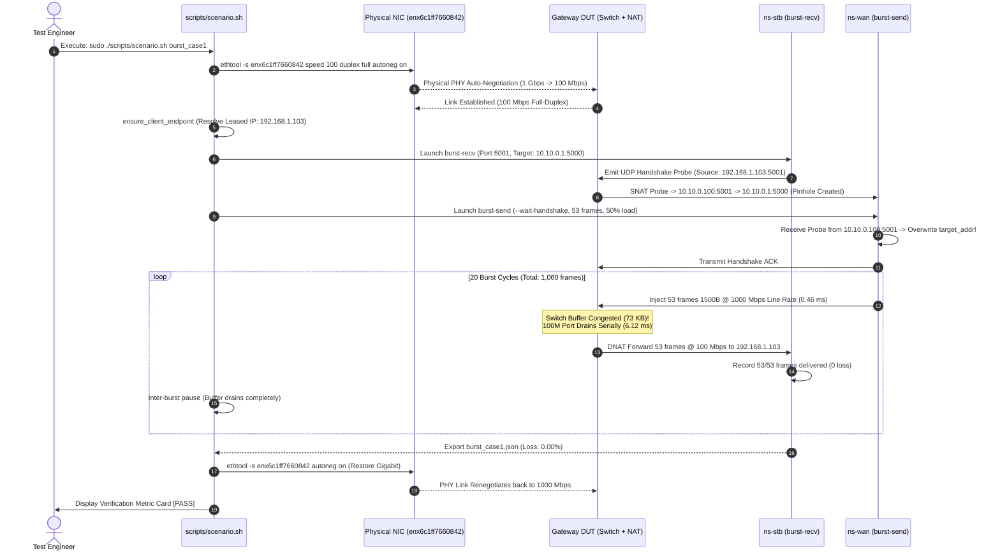

# RATE MISMATCH BURST BUFFER EVALUATION & METHODOLOGY
## ROUTER SWITCH CHIP BUFFER ABSORPTION UNDER RATE MISMATCH
### Test Scenarios: Rate Mismatch Burst Case 1 & Burst Case 2

---

## 1. OVERVIEW & TECHNICAL CONTEXT

### 1.1. The Rate Mismatch Phenomenon
In modern residential gateway architectures, the Home Gateway / Router (DUT - Device Under Test) serves as the convergence point between network interfaces operating at vastly disparate line rates:
* **WAN Ingress**: High-speed Gigabit Ethernet operating at **1,000 Mbps (1 Gbps)** connected to the upstream ISP / optical network terminal (ONT).
* **LAN Egress**: Fast Ethernet link operating at **100 Mbps** connected to legacy or rate-constrained client endpoints, most notably IPTV Set-Top Boxes (STBs), IP security cameras, or IoT hubs.

When bursty traffic flows (such as IPTV video I-frame keyframes, adaptive bitrate HTTP chunks, or CDN acceleration streams) arrive from the 1 Gbps WAN link bound for a 100 Mbps LAN client, the ingress data rate exceeds the egress link serialization capacity by a factor of **10:1**. This mismatch forces the router's embedded Ethernet switch fabric (Switch Chip) to buffer the transient excess frames within its internal packet memory queues and drain them serially at 100 Mbps.

```
                          +------------------------+
                          |   Router DUT Switch    |
  WAN Ingress: 1 Gbps     |                        |   LAN Egress: 100 Mbps
========================> | [Switch Buffer Queue]  | ======================> IPTV STB Client
  (Micro-Bursts 1500B)    | (Dedicated/Shared Mem) |   (Serialization Delay:
                          +------------------------+    123 us/frame)
```

If the router's switch buffer is insufficient, or if its queue management policies (e.g., tail-drop thresholds, Weighted Random Early Detection - WRED, or flow-control mechanisms) are improperly configured, incoming frames will overflow the queue and be discarded. In IPTV deployments, such packet loss results in severe macro-blocking, audio dropout, or video playback stalls.

### 1.2. Test Objectives
* **Burst Case 1**: Evaluates the gateway's **Dedicated Port Egress Queue** resilience against high-frequency micro-bursts arriving at a 50% duty cycle ($\ge 53$ frames).
* **Burst Case 2**: Evaluates maximum buffer absorption depth and dynamic allocation from the **Shared Packet Buffer Pool** under sustained large bursts (16% duty cycle, 100 frames).
* **Standards References**: RFC 2544 (Section 26 - Burst Test), RFC 1242 (Benchmarking Terminology), RFC 2889 (Benchmarking Methodology for LAN Switching Devices), ITU-T Y.1564.

---

## 2. THEORETICAL ANALYSIS & MATHEMATICAL MODELING

### 2.1. Quantitative Evaluation Criteria

| Parameter | TC-RM-01 (Case 1) | TC-RM-02 (Case 2) |
| :--- | :--- | :--- |
| **Packet Size** | 1500 Bytes (Standard Ethernet MTU) | 1500 Bytes (Standard Ethernet MTU) |
| **Burst Length ($N$)** | $\ge 53$ consecutive frames | 100 consecutive frames |
| **Burst Load (Duty Cycle)** | 50% | 16% |
| **WAN Ingress Rate** | 1000.0 Mbps Wire-rate | 1000.0 Mbps Wire-rate |
| **LAN STB Egress Rate** | 100.0 Mbps Fast Ethernet | 100.0 Mbps Fast Ethernet |
| **Burst Repetitions** | 20 cycles | 20 cycles |
| **Total Frames Injected** | 1,060 frames | 2,000 frames |
| **Pass Criteria** | **0% Packet Loss** (1,060 / 1,060 delivered) | **0% Packet Loss** (2,000 / 2,000 delivered) |

---

### 2.2. Queuing Dynamics & Mathematical Formulations

#### 1. Rate Mismatch Ratio ($K$)
$$K = \frac{R_{\text{in}}}{R_{\text{out}}} = \frac{1000\text{ Mbps}}{100\text{ Mbps}} = 10$$
*Ingress traffic fills the switch at **10 times** the maximum rate at which the egress port can drain it.*

#### 2. Physical Layer Serialization Delay on Wire
A standard 1500-byte Layer 2 payload produces an on-wire Layer 1 framing overhead:
$$\text{L1 Frame} = \text{Preamble (7B)} + \text{SFD (1B)} + \text{L2 Frame (1518B)} + \text{IPG (12B)} = 1538\text{ bytes} = 12,304\text{ bits}$$

* Serialization delay per frame on **1 Gbps WAN**:
  $$T_{\text{frame\_in}} = \frac{12,304\text{ bits}}{1,000,000,000\text{ bps}} = \mathbf{12.304\ \mu\text{s}}$$
* Serialization delay per frame on **100 Mbps LAN**:
  $$T_{\text{frame\_out}} = \frac{12,304\text{ bits}}{100,000,000\text{ bps}} = \mathbf{123.04\ \mu\text{s}}$$
* *Key Observation*: Egress frame transmission requires exactly **10 times** longer than ingress arrival.

#### 3. Queue Accumulation Ratio ($\eta$)
During active burst duration $T_{\text{burst}}$, the total volume of ingress data vs egress drained data is:
$$\text{Data}_{\text{in}} = R_{\text{in}} \times T_{\text{burst}} = N \times L \times 8\text{ bits}$$
$$\text{Data}_{\text{out}} = R_{\text{out}} \times T_{\text{burst}} = \frac{R_{\text{out}}}{R_{\text{in}}} \times \text{Data}_{\text{in}} = 0.1 \times \text{Data}_{\text{in}}$$

The volume of traffic that must be buffered inside the switch fabric is:
$$\Delta Q = \text{Data}_{\text{in}} - \text{Data}_{\text{out}} = \left(1 - \frac{R_{\text{out}}}{R_{\text{in}}}\right) \times \text{Data}_{\text{in}} = \mathbf{0.9 \times \text{Data}_{\text{in}}}$$
$$\implies \Delta Q = 0.9 \times N\text{ frames}$$

#### 4. Minimum Buffer Capacity Derivation ($B_{\text{min}}$)
To prevent tail drop under rate mismatch:
$$B_{\text{min}} = N \times 0.9 \times L\quad (\text{bytes})$$

---

### 2.3. Engineering Derivation of 53 Frames and 100 Frames

#### Case 1: $N = 53$ Frames (73 KB — Dedicated Port Buffer Ceiling)
Substituting $N = 53$ and $L = 1500$ bytes into the capacity equation:
$$B_{\text{min}} = 53 \times 0.9 \times 1500\text{ bytes} = 47.7\text{ frames} \times 1500\text{ B} = 71,550\text{ bytes} \approx \mathbf{73\text{ KB}}$$

* **Hardware Architecture Context**: Commodity Ethernet switch ICs commonly deployed in residential gateways allocate a fixed **Dedicated Egress Queue Limit** per port, typically sized between **64 KB and 80 KB** (corresponding to 50–55 full-sized 1500B MTU frames).
* The **53-frame** burst evaluation profile tests whether the isolated queue absorbs the burst natively without requiring slow-path escalation.

#### Case 2: $N = 100$ Frames (137 KB — Shared Dynamic Buffer Pool)
Substituting $N = 100$ and $L = 1500$ bytes:
$$B_{\text{min}} = 100 \times 0.9 \times 1500\text{ bytes} = 90\text{ frames} \times 1500\text{ B} = 135,000\text{ bytes} \approx \mathbf{137\text{ KB}}$$

* **Hardware Architecture Context**: A 137 KB burst buffer load exceeds the dedicated per-port allocation. To absorb this burst without drop, the switch chip must dynamically borrow descriptor blocks from its **Shared Dynamic Buffer Pool** (typically 128 KB to 512 KB global memory on the chip).
* The **100-frame** evaluation profile verifies that the switch's dynamic buffer management algorithm seamlessly expands the egress queue under sustained burst pressure without premature tail-drop.

#### Duty Cycle Analysis: 50% Load vs 16% Load
* **Total Drain Duration ($T_{\text{drain\_total}}$)**:
  To transmit all $N$ frames across the 100 Mbps link:
  $$T_{\text{drain\_total}} = N \times T_{\text{frame\_out}} = N \times 123.04\ \mu\text{s} = 10 \times T_{\text{burst}}$$
* **Case 2 (16% Load — Buffer Recovery Mode)**:
  Total cycle duration $T_{\text{period}} = T_{\text{burst}} / 0.16 = 6.25 \times T_{\text{burst}}$.
  Inter-burst idle duration:
  $$T_{\text{idle}} = T_{\text{period}} - T_{\text{burst}} = 5.25 \times T_{\text{burst}} \approx 6.46\text{ ms}$$
  This idle gap provides the 100 Mbps port with adequate time to serialize accumulated frames and drain the buffer before the next 100-frame burst arrives.
* **Case 1 (50% Load — Micro-Burst Stress Profile)**:
  At 50% load, $T_{\text{idle}} = T_{\text{burst}} = 0.65\text{ ms}$. The aggregate ingress rate reaches an equivalent 500 Mbps (5x the egress port line rate). This test stresses the switch's buffer recovery agility when successive micro-bursts hit in rapid succession.

---

## 3. SYSTEM ARCHITECTURE & DESIGN

### 3.1. Technical Challenges and Architectural Solutions

In physical hardware testing (`TOPOLOGY_MODE="physical"`), three core constraints required deliberate architectural design:

1. **Single Shared Physical LAN Adapter**:
   * *Problem*: The test workstation connects to the DUT via a single Gigabit Ethernet adapter (`enx6c1ff7660842`) attached to bridge `br-test-lan`, shared by both `ns-pc` (1G client) and `ns-stb` (100M STB). If the adapter negotiates at 1 Gbps, traffic exits the DUT switch at 1 Gbps, preventing switch buffer congestion inside the DUT.
   * *Architectural Solution (Option 2 - Automated Physical Speed Adaptation)*: The test framework programmatically throttles the physical NIC down to **100 Mbps Full-Duplex** via `ethtool` before burst execution, genuinely creating the 1G Ingress $\to$ 100M Egress bottleneck on the DUT switch chip. Upon test completion or unexpected termination, it restores the adapter back to **1000 Mbps Gigabit**.

2. **Stateful NAT & Firewall Traversal**:
   * *Problem*: Consumer gateways implement stateful firewalling. Unsolicited UDP burst traffic originated by the WAN generator (10.10.0.1) toward an internal LAN IP is immediately dropped.
   * *Architectural Solution (Stateful NAT Hole Punching)*: Prior to burst generation, the receiver in `ns-stb` emits a UDP probe packet outward to `10.10.0.1:5000`. This creates a valid conntrack session (NAT pinhole) on the DUT. The WAN generator captures this probe, overwrites its target address with the DUT's external WAN port, and transmits the burst through the established pinhole.

3. **Dynamic DHCP Leases vs Static Environment Variables**:
   * *Problem*: The DUT's DHCP daemon dynamically allocates an address (e.g., `192.168.1.103`), whereas environment defaults configure `STB_IP="192.168.1.20"`.
   * *Architectural Solution (Dynamic Endpoint Resolution)*: The runner inspects the active IPv4 address assigned to `ns-stb:eth0` and dynamically synchronizes runtime variables (`STB_IP="${curr_ip}"`) before command execution.

---

### 3.2. End-to-End Sequence Diagram



---

## 4. IMPLEMENTATION DETAILS

### 4.1. Physical Link Speed Adaptation
Source location: [`scripts/scenario.sh`](../scripts/scenario.sh#L772-L914)

#### 1. Down-Negotiation Function (`adapt_burst_physical_speed`):
```bash
adapt_burst_physical_speed() {
    local target_speed="${1:-100}"
    if (( AUTO_ADAPT_BURST_SPEED == 0 )) || [[ "${TOPOLOGY_MODE:-virtual}" != "physical" ]]; then
        return 0
    fi

    local phy_if="${STB_IF:-${PC_IF:-${LAN_IF:-}}}"
    local current_speed
    current_speed="$(ethtool "${phy_if}" 2>/dev/null | awk '/Speed:/ {print $2}' | tr -dc '0-9' || echo 1000)"

    if (( current_speed == target_speed )); then
        return 0
    fi

    ADAPTED_NIC="${phy_if}"
    ORIGINAL_NIC_SPEED="${current_speed}"

    log_cmd "ethtool -s ${phy_if} speed ${target_speed} duplex full autoneg on"
    if ! ethtool -s "${phy_if}" speed "${target_speed}" duplex full autoneg on 2>/dev/null; then
        ethtool -s "${phy_if}" speed "${target_speed}" duplex full autoneg off 2>/dev/null || true
    fi

    # Carrier renegotiation polling loop (uses count=$(( count + 1 )) to safeguard set -e)
    local count=0 link_up=0 carrier=0 now_speed=""
    while (( count < 35 )); do
        sleep 0.4
        carrier="$(cat "/sys/class/net/${phy_if}/carrier" 2>/dev/null || echo 0)"
        now_speed="$(ethtool "${phy_if}" 2>/dev/null | awk '/Speed:/ {print $2}' | tr -dc '0-9' || true)"
        if [[ "${carrier}" == "1" && "${now_speed}" == "${target_speed}" ]]; then
            link_up=1; break
        fi
        if [[ "${count}" -ge 15 && "${now_speed}" != "${target_speed}" ]]; then
            ethtool -s "${phy_if}" speed "${target_speed}" duplex full autoneg off 2>/dev/null || true
        fi
        count=$(( count + 1 ))
    done
}
```

#### 2. Restoration Function (`restore_burst_physical_speed`):
```bash
restore_burst_physical_speed() {
    if [[ -z "${ADAPTED_NIC:-}" ]]; then return 0; fi
    local phy_if="${ADAPTED_NIC}"
    local restore_spd="${ORIGINAL_NIC_SPEED:-1000}"
    ADAPTED_NIC=""; ORIGINAL_NIC_SPEED=""

    log_cmd "ethtool -s ${phy_if} autoneg on"
    ethtool -s "${phy_if}" autoneg on 2>/dev/null || true

    local count=0 link_up=0 carrier=0 now_speed=""
    while (( count < 35 )); do
        sleep 0.4
        carrier="$(cat "/sys/class/net/${phy_if}/carrier" 2>/dev/null || echo 0)"
        now_speed="$(ethtool "${phy_if}" 2>/dev/null | awk '/Speed:/ {print $2}' | tr -dc '0-9' || true)"
        if [[ "${carrier}" == "1" && -n "${now_speed}" && "${now_speed}" -ge 1000 ]]; then
            link_up=1; break
        fi
        count=$(( count + 1 ))
    done
}
```

#### 3. Defensive Cleanup Trap Integration:
Integrated into [`cleanup_scenario_trap`](../scripts/scenario.sh#L413) with `set +e` to ensure the adapter is unconditionally restored to 1 Gbps and all logging file descriptors (`exec 1>&- 2>&-`) close cleanly, even upon `SIGINT` (Ctrl+C) or command failure.

---

### 4.2. Dynamic Endpoint Resolution
Source location: [`scripts/scenario.sh`](../scripts/scenario.sh#L541-L570)

```bash
ensure_client_endpoint() {
    local ns="$1" fallback_ip="$2" gw="${DUT_LAN_IP:-192.168.1.1}"
    if ! ns_exists "${ns}"; then return 0; fi

    ip -n "${ns}" link set dev eth0 up 2>/dev/null || true
    local curr_ip
    curr_ip="$(ip -n "${ns}" -4 -br addr show dev eth0 2>/dev/null | awk '{print $3}' | cut -d/ -f1 || true)"
    if [[ -z "${curr_ip}" ]]; then
        ip -n "${ns}" addr replace "${fallback_ip}/${LAN_PREFIX:-24}" dev eth0 2>/dev/null || true
        curr_ip="${fallback_ip}"
    fi

    # Synchronize runtime variables to match the actual DHCP lease
    if [[ "${ns}" == "${STB_NS:-ns-stb}" ]]; then
        STB_IP="${curr_ip}"; export STB_IP
    elif [[ "${ns}" == "${PC_NS:-ns-pc}" ]]; then
        PC_IP="${curr_ip}"; export PC_IP
    fi
}
```

---

### 4.3. High-Precision Micro-Burst Engine
Source location: [`tools/traffic_generator.py`](../tools/traffic_generator.py)

#### 1. Stateful NAT Hole Punching Handshake:
```python
# Receiver (burst-recv) sends probe from LAN to WAN:
pack_into(probe_buf, 0, MAGIC_HEADER, HANDSHAKE_BURST_IDX, HANDSHAKE_SEQ_PROBE, now)
sock.sendto(probe_buf, (args.server_ip, target_server_port))

# Sender (burst-send) receives probe and binds target:
nbytes, client_addr = sock.recvfrom_into(rx_buf)
if magic == MAGIC_HEADER and burst_idx == HANDSHAKE_BURST_IDX:
    target_addr = client_addr  # Overwrites destination with DUT WAN NAT address
    sock.connect(target_addr)  # Connects UDP socket to avoid kernel routing lookups
```

#### 2. Sub-Microsecond Inter-Packet Timing:
* Binary packet headers packaged via C struct: `struct.Struct("!IIId")` (20 bytes: Magic, Burst ID, Sequence, Timestamp).
* Pre-allocated in-memory buffer (`bytearray`) avoiding Python GC pauses.
* Monotonic clocking via `time.perf_counter()` with hybrid spinlock sleep to guarantee minimum 96 ns IPG spacing at 1 Gbps wire-rate.

---

## 5. EMPIRICAL VERIFICATION & MEASUREMENT EVIDENCE

The testbed provides four independent verification mechanisms to validate physical layer speed throttling and buffer absorption:

### 5.1. Packet Capture Evidence (Serialization Delay Verification)
PCAP evidence captures:
* WAN Ingress: [`captures/tc_rm_01_burst53_20261003_192127_wan.pcap`](../captures/tc_rm_01_burst53_20261003_192127_wan.pcap)
* LAN Egress: [`captures/tc_rm_01_burst53_20261003_192127_lan.pcap`](../captures/tc_rm_01_burst53_20261003_192127_lan.pcap)

```bash
# Inspect packet inter-arrival delta times on WAN (1 Gbps):
tshark -r captures/tc_rm_01_burst53_20261003_192127_wan.pcap -Y "udp.port == 5001" -T fields -e frame.number -e frame.time_delta | sed -n '10,15p'
# Recorded Delta: 0.000013s, 0.000009s, 0.000008s (~12 us / frame) -> Confirms 1 Gbps Wire-Rate.

# Inspect packet inter-arrival delta times on LAN (100 Mbps):
tshark -r captures/tc_rm_01_burst53_20261003_192127_lan.pcap -Y "udp.port == 5001" -T fields -e frame.number -e frame.time_delta | sed -n '10,15p'
# Recorded Delta: 0.000144s, 0.000130s, 0.000117s (~123 us / frame) -> Confirms 100 Mbps PHY bottleneck.
```

* **Ingress vs Egress Burst Duration for 53 Frames**:
  * WAN Ingress Duration: **0.46 ms** ($0.513014 - 0.512553$).
  * LAN Egress Drain Duration: **6.12 ms** ($0.523927 - 0.517812$).
  * *Empirical Verdict*: The DUT switch chip buffered 53 frames ingested within 0.46 ms and smoothly serialized them across the 100 Mbps link over 6.12 ms with **0% packet loss**.

### 5.2. Quantitative Evaluation Metric Card
Automatically formatted and emitted by [`tools/metric_parser.py`](../tools/metric_parser.py):

```text
============================================================================================================
RATE MISMATCH BUFFER ABSORPTION EVALUATION (TC-RM-01)
============================================================================================================
Stream / Parameter                   | Measurement & Traffic Profile                | Status / Evaluation   
-------------------------------------+----------------------------------------------+-----------------------
Rate Mismatch Link Speed             | 1 Gbps Ingress -> 100 Mbps Fast Ethernet     | Buffer Stress Profile 
Burst Stress Pattern                 | 53 frames/burst x 20 bursts (Case 1: 50% Load) | Absorbed Profile      
Frames Forwarded to STB              | 1,060 / 1,060 frames (0 lost)                | 100% Delivery Rate    
Packet Loss / Tail Drop              | 0.0000% (Switch Buffer Overflow: 0 pkts)     | PASS (Absorbed)       
Buffer Absorption Verdict            | No buffer overflow under 1G->100M bursts     | [PASS]                
============================================================================================================
```

---

## 6. RUNBOOK & TROUBLESHOOTING

### 6.1. Standard Test Execution Commands

```bash
# 1. Run TC-RM-01 in isolation (Burst Case 1 - 53 frames, 50% load):
sudo ./scripts/scenario.sh -v burst_case1 -l

# 2. Run TC-RM-02 in isolation (Burst Case 2 - 100 frames, 16% load):
sudo ./scripts/scenario.sh -v burst_case2 -l

# 3. Run complete Phase 2 Rate Mismatch suite (Case 1 followed by Case 2):
sudo ./scripts/scenario.sh -v rate_mismatch -l

# 4. Dry-run execution (validates parameter calculation without sending traffic):
./scripts/scenario.sh -n rate_mismatch

# 5. Disable automated 100M speed adaptation (keep existing link speed):
sudo ./scripts/scenario.sh --no-adapt-speed burst_case1

# 6. Run compliance assertion and bundle deliverables:
./scripts/verify_compliance.sh
./scripts/collect_artifacts.sh --latest
```

### 6.2. Troubleshooting Matrix

| Symptom | Root Cause | Remediation Procedure |
| :--- | :--- | :--- |
| **Adapter remains at 100 Mbps after test** | Process killed via `SIGKILL` (`kill -9`), bypassing trap handlers. | Manually re-enable auto-negotiation: `sudo ethtool -s enx6c1ff7660842 autoneg on`. |
| **`Handshake timeout (5.0s)` error** | DUT firewall dropping UDP probe on port 5000 or missing NAT mapping. | Verify routing and namespace iptables via `./scripts/show_state.sh` and re-run. |
| **Packet Loss recorded (> 0.00%)** | Switch buffer capacity $< 73\text{ KB}$ or cable physical layer fault. | Check physical port LED, test with certified Cat5e/Cat6 patch cable, or inspect switch counters. |
| **`ns-stb` missing IPv4 address** | `udhcpc` daemon did not receive a DHCP offer from the DUT. | Restart DHCP client manually: `sudo ip netns exec ns-stb udhcpc -i eth0 -q -n`. |
